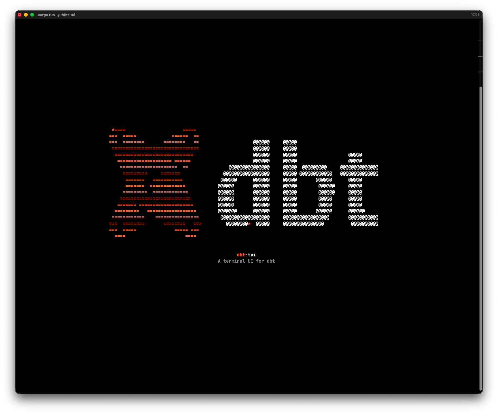
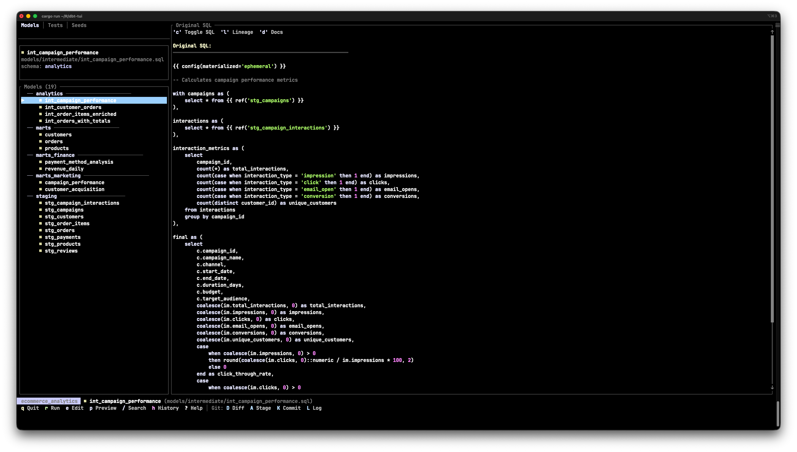
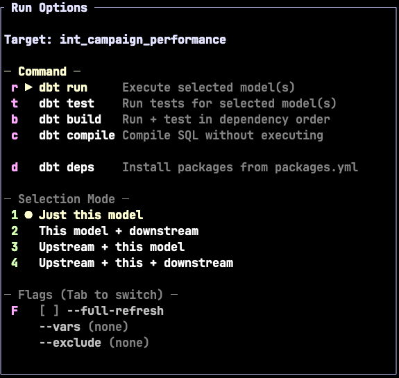
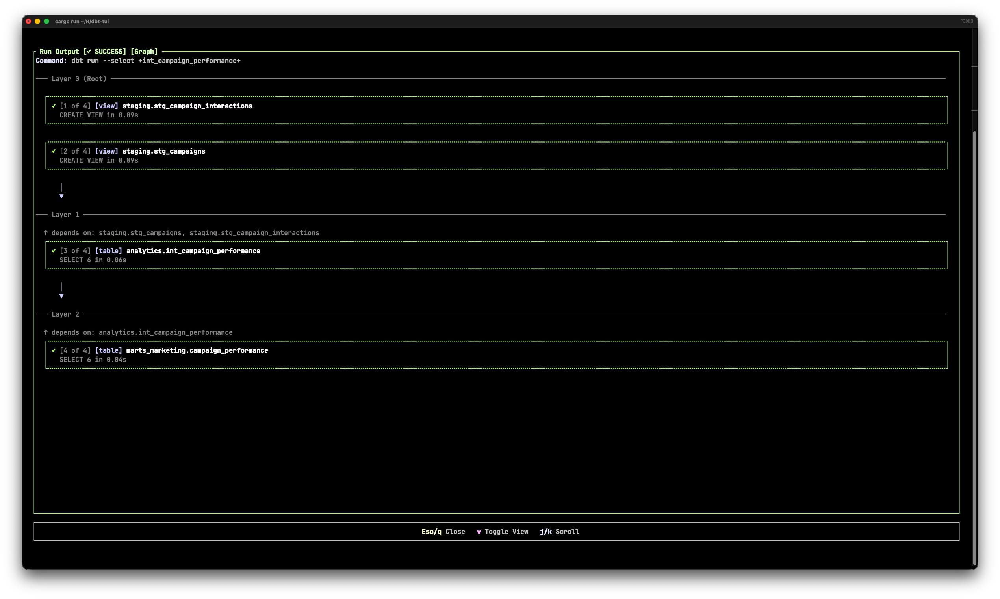
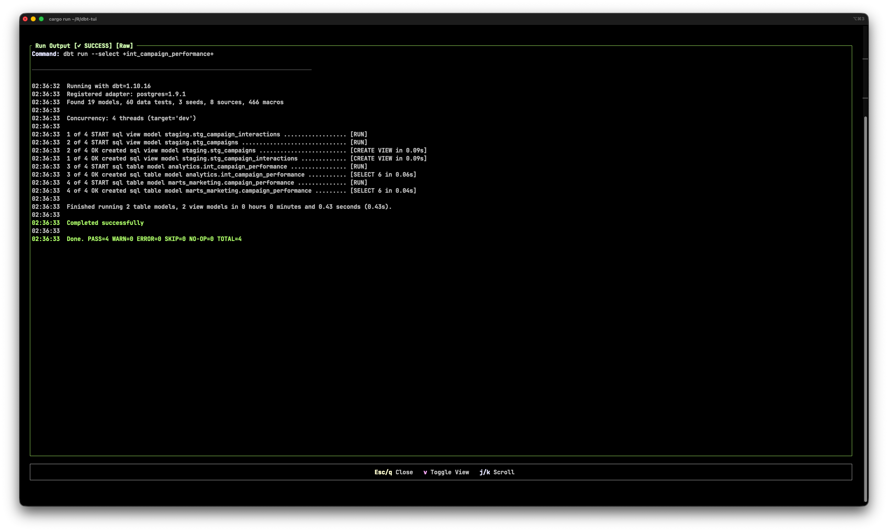
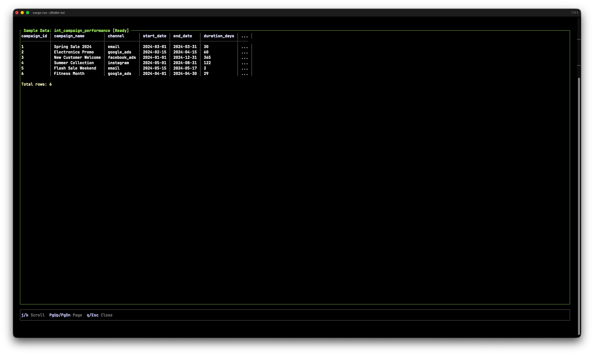
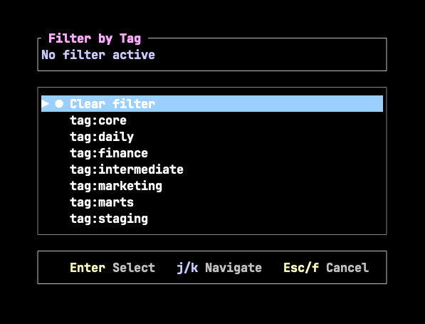
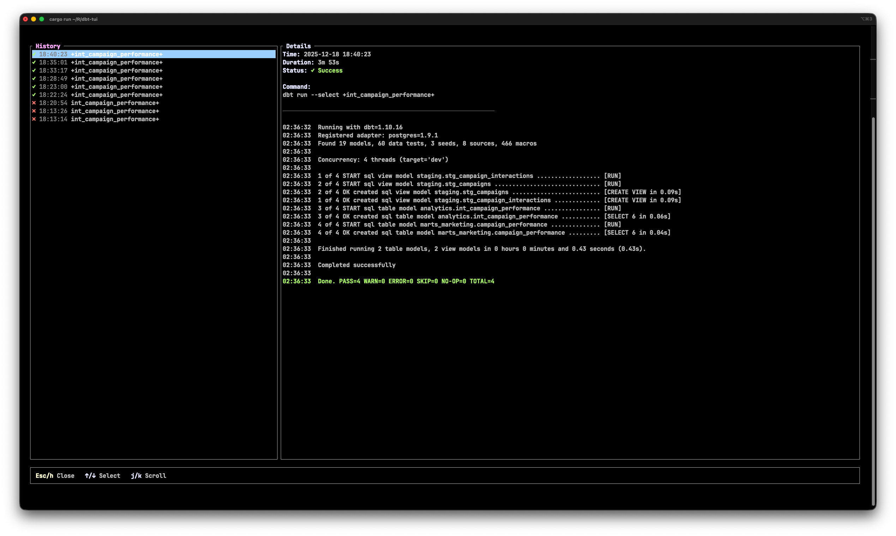
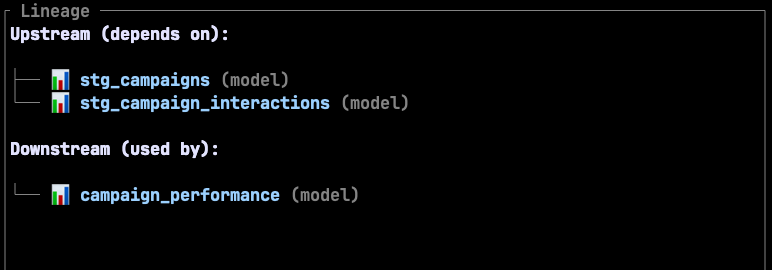

<p align="center">
  <h1 align="center">dbt-tui</h1>
  <p align="center">
    <strong>A terminal UI for dbt projects</strong>
  </p>
</p>

<p align="center">
  <a href="#features">Features</a> •
  <a href="#installation">Installation</a> •
  <a href="#quick-start">Quick start</a>
</p>

---

**dbt-tui** is a fast, keyboard-driven terminal UI for [dbt](https://www.getdbt.com/) (data build tool). Think [lazygit](https://github.com/jesseduffield/lazygit), but for your data transformations.

Built with Rust for speed and efficiency. Single binary. Simple installation.



## Why dbt-tui?

| Pain point                                         | Solution                                      |
|----------------------------------------------------|-----------------------------------------------|
| Jumping between terminal, IDE, and database client | Everything in one terminal interface          |
| Scrolling through walls of dbt output              | Prettified log viewer with real-time progress |
| Losing track of what you ran and when              | Full run history                              |
| Understanding model dependencies                   | Lineage visualization                         |

## Features

### Project overview

Browse all your models, tests, and seeds in a unified tabbed interface. No more jumping between files or running CLI commands to find what you need.



### Run dbt commands

Execute `dbt run`, `dbt test`, `dbt build`, and `dbt compile` with a single keystroke. Run just the selected model, or include upstream dependencies, downstream dependencies, or both.



### Prettified logs

Watch your dbt commands execute in real-time with a graphical progress view. Models are organized by dependency layer with status indicators. Toggle between prettified and raw output modes.

Prettified:


Raw:


### Data preview

Preview model output directly in the terminal using `dbt show`. No need to connect to your warehouse separately.



### Search and filter

Find models instantly with real-time search. Filter by tags to focus on specific parts of your project.



### Run history

View your complete run history with full output logs.



### Lineage

View upstream and downstream dependencies for any model in a tree-style display.



### Editor integration

Press `e` to open any file in your `$EDITOR` (vim, nvim, code, etc.). Edit, save, and return seamlessly.

## Installation

### Build from source

```bash
git clone https://github.com/manfredcml/dbt-tui.git
cd dbt-tui
cargo build --release

# The binary will be at ./target/release/dbt-tui
```

## Quick start

```bash
# Start the demo (requires Docker)
make demo
```

This will:

1. Start a Postgres database in Docker
2. Load sample e-commerce data
3. Run all dbt models and tests
4. Launch dbt-tui

## Configuration

dbt-tui stores settings in `~/.dbt-tui/config.json`:

```json
{
  "project_path": "/path/to/your/dbt/project",
  "dbt_binary_path": "dbt",
  "target": "dev"
}
```

## Contributing

Contributions are welcome! Please open an issue or submit a pull request.

## License

This project is under the **MIT License**.
